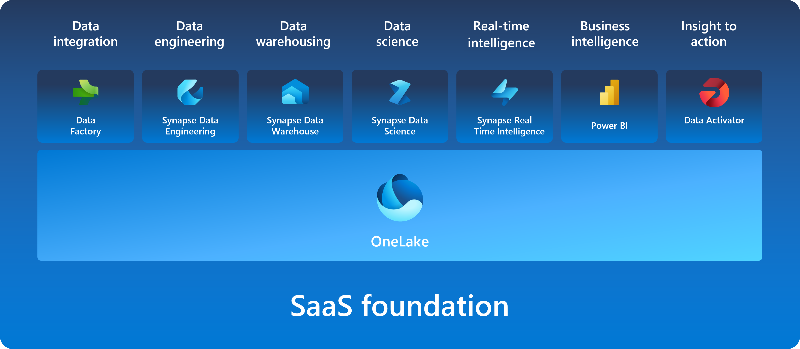

# MS Fabric

[참고자료]
- https://learn.microsoft.com/ko-kr/training/modules/introduction-end-analytics-use-microsoft-fabric/1-introduction

## MS Fabric 서비스 종류
- Data Engineering (데이터 엔지니어링)
- Data Integration (데이터 통합)
- Data Warehousing (데이터 웨어하우징)
- Real-Time Intelligence (실시간 분석)
- Data Science (데이터 과학)
- Business Intelligence (비즈니스 인텔리전스)

## MS Fabric 이란?
SaaS 형태의 제품으로 데이터 전문가들이 협업할 수 있는 단일 통합 환경에서 데이터를 수집, 저장, 처리, 분석 할 수 있는 플랫폼입니다.
위의 서비스들을 사용 할 수 있습니다.

## OneLake 란?

다양항 벤더사의 서비스들을 Fabric 한곳에서 관리하는데, 플랫폼 내의 모든 데이터는 OneLake 에서 접근 가능합니다. 이를 통해 [데이터 사일로 현상](https://www.moef.go.kr/sisa/dictionary/detail?idx=1351)이 방지됩니다.
데이터용 OneDrive 처럼 생각하면 쉽습니다.

[주요 기능]
- OneLake의 기본 스토리지 형식은 Delta 입니다. ([Delta 형식에 대해 자세히 알아보기](https://learn.microsoft.com/ko-kr/azure/data-factory/format-delta))
  - [Delta 포맷에 대한 장점 소개 아티클](https://medium.com/datalex/5-reasons-to-use-delta-lake-format-on-databricks-d9e76cf3e77d)
    - Delta 포맷은 Parquet 처럼 **컬럼 지향 포맷**이기 때문에 대량 데이터에 대한 분석작업에 적합 (참고: [컬럼형 DB는 왜 빠른가](https://dataonair.or.kr/db-tech-reference/d-lounge/expert-column/?mod=document&uid=52606))
    - Delta 트랜젝션 로그 파일을 사용하면 Spark 에 [Read/Write ACID](https://learn.microsoft.com/ko-kr/azure/databricks/lakehouse/acid) 와 [Serializable 혹은 그보다 약한 WriteSerializable 수준의 isolation](https://learn.microsoft.com/ko-kr/azure/databricks/optimizations/isolation-level#--write-serializable-vs-serializable-isolation-levels) 을 보장.
    - Delta 캐싱 기능을 통해 Spark Engine 에 데이터를 작업자 메모리에 캐싱하도록 할 수 있음 (Azure Saas 에서 작업하므로 그리 중요하진 않을 것 같습니다.)
    - Time Traveling 기능 (redo 로그, WAL (Write Ahead Log) 처럼 (관심있으신 분들은 Real MySQL 참고해주세요) 모든 로그에 대한 작업 로그가 남기 때문에 해당 과거 시간으로 데이터를 원복할 수 있습니다.)
    - 데이터 세트 병합 기능
    - 데이터 최적화 기능
    - 가벼운 스키마 변경
- OneCopy
  - 데이터 복제시 데이터 이동/복제 필요없이 단일 복사본 (OneCopy) 를 통해 데이터를 읽을 수 있습니다.
- OneLake 는 ADLS (Azure Data Lake Storage) 기반으로 빌드됩니다.
  - Delta, Parquet, CSV, JSON 등의 모든 파일형식 저장 가능
- 심지어 Fabric의 모든 컴퓨팅 엔진을 OneLake 에 저장 가능. 따라서 데이터는 따로 이동 및 복사 필요 없이 서로 다른 벤더의 서비스에서 액세스 하더라도 해당 데이터 접근 가능합니다.
- 테이블 형식 데이터는 Delta-Parquet 형식으로 데이터가 작성됨 (Delta-Pqrquet 형식이라는 것은 곧 Delta 형태를 뜻합니다. 참고: https://stackoverflow.com/questions/77278117/microsoft-fabric-delta-parquet-format)
- 데이터, 파일 혹은 스토리지 위치에 대한 **바로가기 기능** 으로 어떤 서비스를 사용하더라도 동일한 원본 데이터에 접근할 수 있습니다.

## Fabric 솔루션

- Synapse Data Engineering (Synapse 데이터 엔지니어링)
  - 대규모 데이터 변환 (Transform) 을 위해 Spark 플랫폼을 사용하는 환경입니다.
- Synapse Data Warehouse (Synapse 데이터 웨어하우스)
- Synapse Data Science (Synapse 데이터 과학)
  - 스케일링 가능한 환경에서 Azure Machine Learning 및 Spark 를 사용 가능한 환경입니다.
- Synapse Real-Time intelligence (Synapse 실시간 분석)
  - 다량의 데이터를 실시간으로 쿼리하고 분석할 수 있습니다.
- Data Factory
  - 데이터 이동 및 변환하기 위해 사용하는 Azure Data Factory 와 Power Query 를 결합한 데이터 통합 시스템 입니다.
- Power BI

## 보안 및 거버넌스 관리

Fabric 의 OneLake는 한곳에서 관리되고 협업을 위해 데이터가 공개되지만, 보안 관리를 위해 [관리자가 조직 내 **RBAC** 관리](https://learn.microsoft.com/ko-kr/fabric/onelake/security/data-access-control-model)가 가능합니다.
관리 센터에서 그룹 및 권한을 부여하고, 사용 및 성능 모니터링이 가능합니다.

저희 팀에서 알아본 바는 다음과 같습니다.

- 각 계정마다 자신의 작업 영역(Work Space) 이 생성됩니다.
- 자신의 작업 영역 외에도 협업을 위한 작업 영역을 생성 할 수 있습니다.
- 작업 영역에 대한 접근 권한은 단일 계정뿐만 아니라 그룹에 대해서도 권한 추가가 가능합니다.
- 작업 영역 내 작업물 생성시 해당 작업 영역에 설정된 권한이 자동부여됩니다.
- 각 작업 영역마다 그룹/개인별로 역할을 다르게 부여 할 수 있습니다.
- 역할은 다음과 같이 구성되어 있습니다. (참고: https://learn.microsoft.com/ko-kr/fabric/data-engineering/workspace-roles-lakehouse)
  - 관리자
  - 멤버
  - 참가자
  - 뷰어
- Fabric 테넌트는 Microsoft Purview Information Protection 기능도 제공되기 때문에, 데이터에 대한 민감도 레이블을 지정하고 중요 데이터를 보호할 수 있습니다.