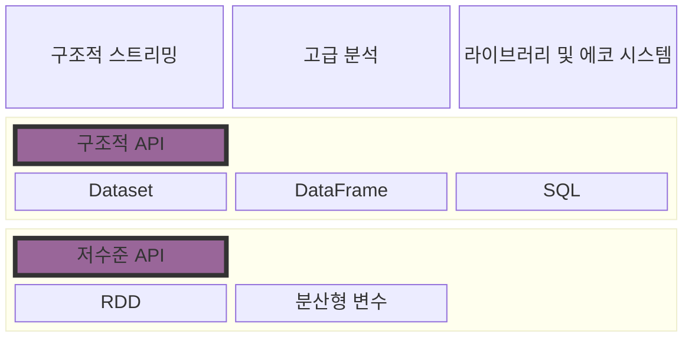

# Spark Overview

Spark
- 병렬 처리 오픈소스 엔진
- 클러스터 환경에서 데이터를 병렬 처리하는 라이브러리 집합
- 4가지 언어 지원 (Python, java, scala, R)
- SQL, Streaming, ML 라이브러리 지원
  > 같은 연산 엔진, 일관성 있는 API 로 수행 가능하도록 설계 되어 있음 [p.56] 

[//]: # (TODO - 어떤 일관성 레벨을 보장하는지 찾아보기)
> [!IMPORTANT] 
> 어떤 일관성을 보장하는지 찾아보기. 

- 단일 노트북 환경에서 수천대 서버로 된 클러스터 환경까지 확장 가능 
  > 예를들어, SQL 쿼리로 데이터를 읽고 ML 머신러닝 라이브러리로 머신러닝 모델을 평가해야할 경우 스파크 엔진은 이 두 단계를 하나로 병합하고 데이터를 한번만 조회할 수 있게 해줍니다. [p.56] 

