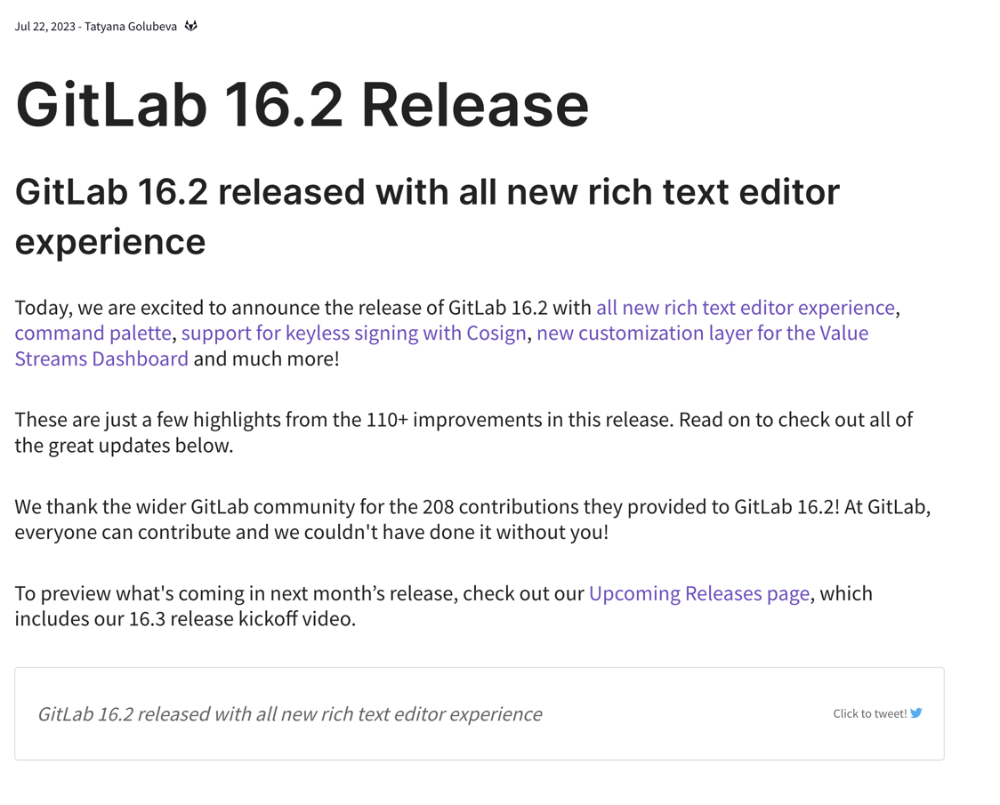
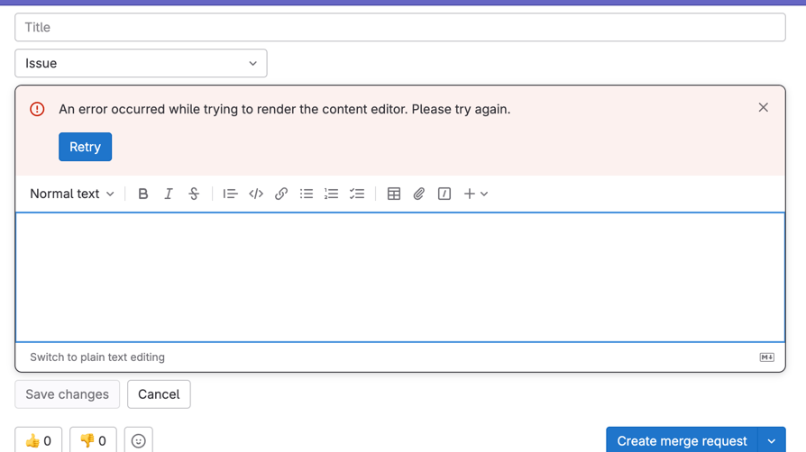
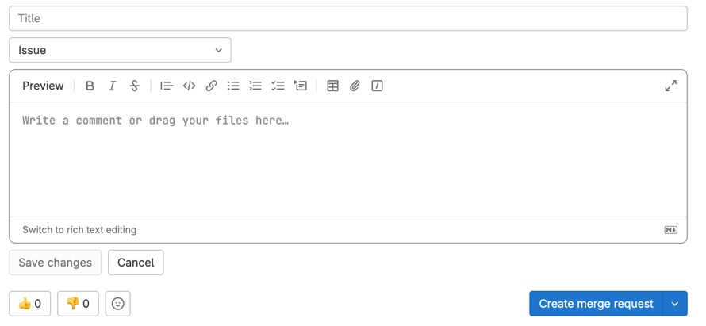
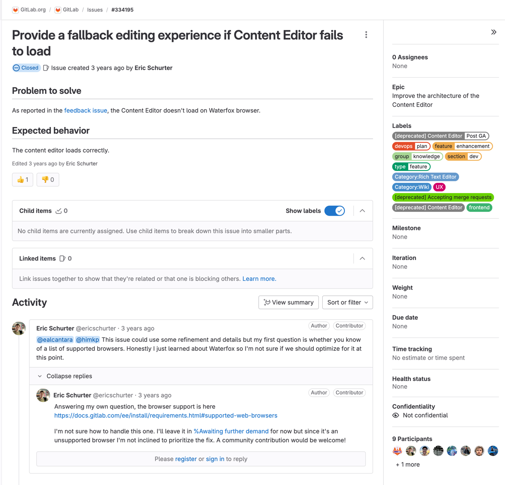
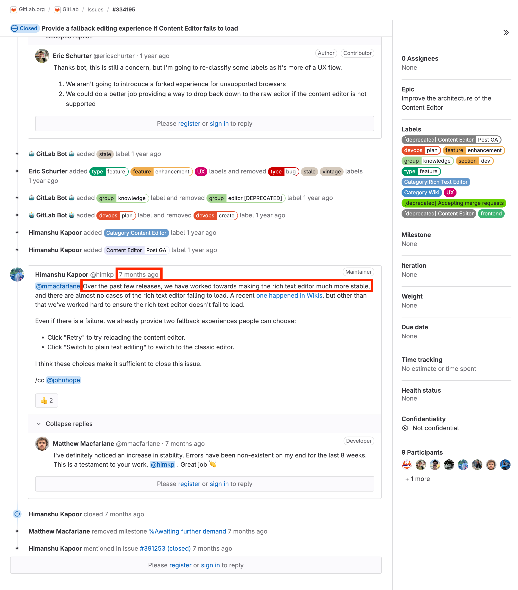
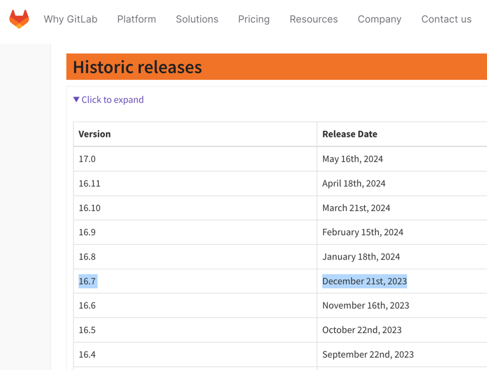
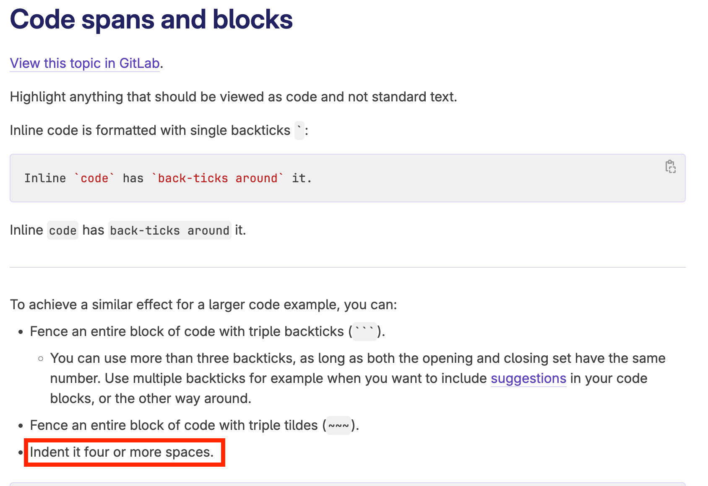

# Gitlab Text Editor 사용성 개선기
## 계기
이슈 탭, wiki 등 text 편집기가 매우 불편했다. 해당 버전은 16.6 버전..
가장 최신 버전을 사용했다고 생각했는데 오래된 버전이었다.

16.2 버전 부터 Rich Text Editor 기능이 추가되었다고 하는데,

Ref: https://about.gitlab.com/releases/2023/07/22/gitlab-16-2-released/

## 문제상황
실질적으로 plain text 에서 Rich Text로 변경하면 오류가 발생한다.
뿐만 아니라 plain text 버전에서도 에디터 내에 탭이 먹지 않는다.

## 히스토리 파악
gitlab.com 에 issue 로 등록된 것을 확인했다.

Ref: https://gitlab.com/gitlab-org/gitlab/-/issues/334195

현재기준(24년 7월 9일) close 멘션을 확인해보니, 7개월 전에 rich text editor 를 안정화 시키기 위한 몇번의 작업들을 배포했다고 한다.

그렇다면 7개월 전인 23년 12월 쯤에는 안정화 되었다고 하니, 23년 12월에 배포된 16.7 버전으로 배포해야겠다고 판단.

Ref: https://about.gitlab.com/releases/#historic-releases

## 해결 방법
16.7 버전으로 업데이트 했지만 동일..
16.11 버전으로 업데이트 되어서야 제대로 동작했다.

하지만 탭 단축키는 아직 해결되지 않은 것 같다..
아래 사진은 16.11 버전 가이드.

Ref: https://docs.gitlab.com/16.11/ee/user/markdown.html
