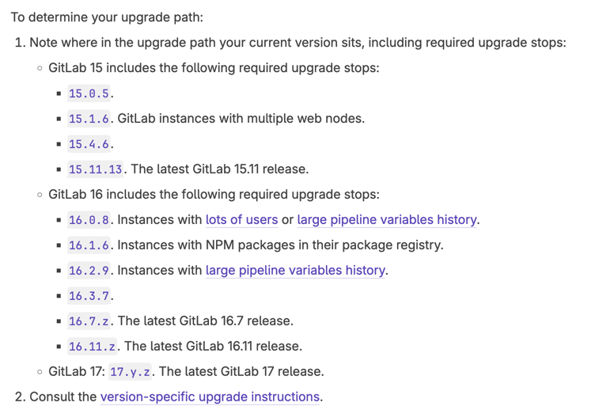

# Gitlab 설정 Trouble Shooting Log

- Version Upgrade 는 문서에 제시된 버전에 따라 순차적으로 적용 해야 함.
  Ref: https://docs.gitlab.com/ee/update/index.html#upgrade-paths

현재 16.6.z 이므로,
16.7.z > 16.11.z > 17.y.z 순으로 로 업데이트 필요

