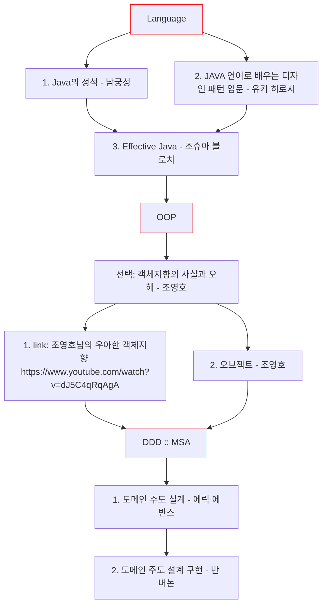
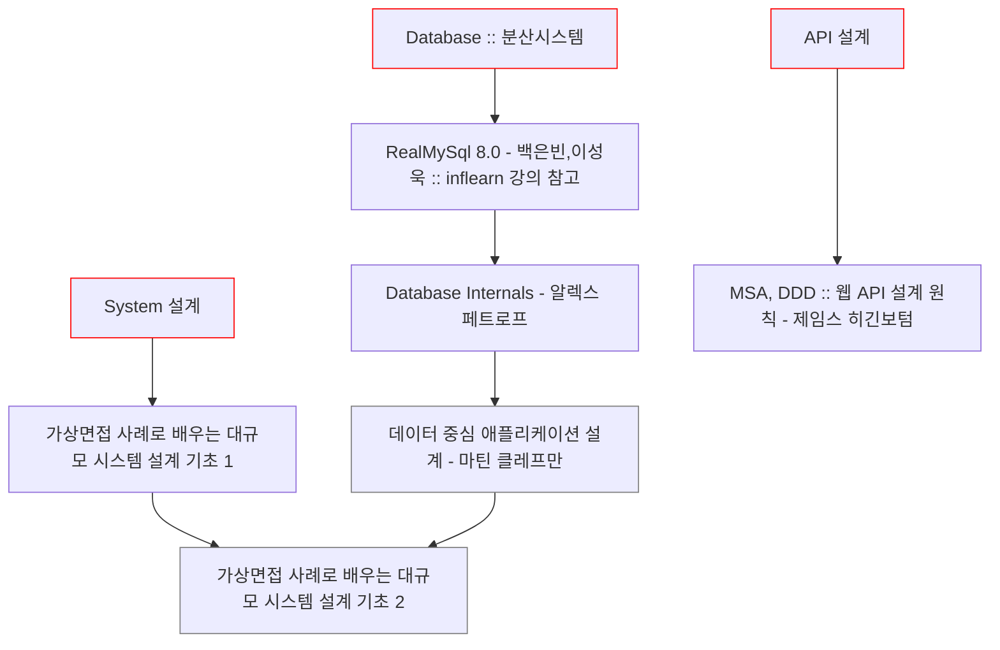
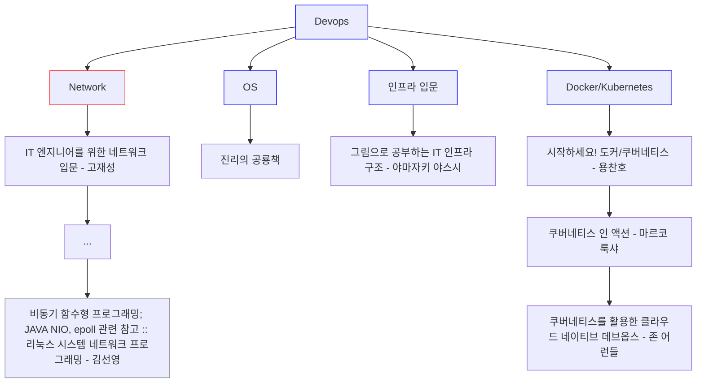
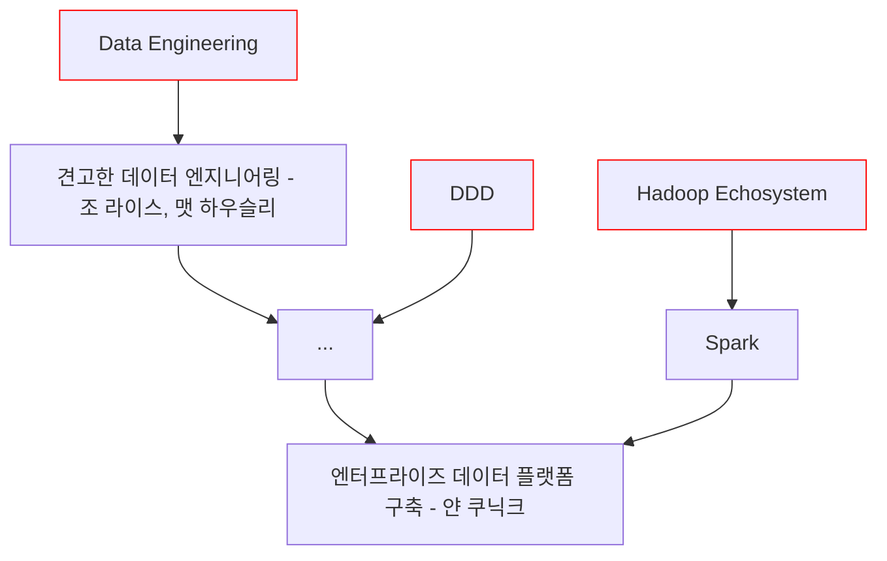

# BackEnd Roadmap for java

- 객체지향의 사실과 오해, 오브젝트 저자이신 조영호님의 우아한 객체지향 강의 링크 : https://www.youtube.com/watch?v=dJ5C4qRqAgA
    - 꼭 한번 보시길 추천드립니다! DDD 에 대한 직접적인 언급은 하지 않으셨지만 DDD 로 설계하는 기법에 대해 설명하고 계십니다.
- 아아.. [[JAVA 언어로 배우는 디자인 패턴 입문 - 유키 히로시](https://www.yes24.com/Product/Goods/115576266)] 는 신판이 나왔으니 꼭 신판으로 보세요! 요즘 트렌트에 맞게 더욱 자세히 설명 되어 있습니다.
- 오브젝트 - 조영호
    - 객체지향의 설계와 구현, 기본적인 원칙(SOLID, DRY, KISS 등)에 대해 자세히 다룹니다.
- [도메인 주도 설계 - 에릭 에반스](https://www.yes24.com/Product/Goods/5312881)
    - 실제 코드보다는 DDD에 대한 이론에 대해 다룹니다.
- [도메인 주도 설계 구현 - 반 버논](https://www.yes24.com/Product/Goods/25100510)
    - 위의 [[도메인 주도 설계 - 에릭 에반스](https://www.yes24.com/Product/Goods/5312881)] 를 기반으로 한 직접적인 구현에 대해 다루고 있습니다.
- 가상 면접 사례로 배우는 대규모 시스템 설계 기초 1
    - 기본적인 인프라 아키텍처에 대한 설계부터 분산시스템 설계 기법 및 알고리즘에 대해 다룹니다.
- 가상 면접 사례로 배우는 대규모 시스템 설계 기초 2
    - Database 에 대한 기반지식을 탄탄히 다지고 2권을 읽으시길 추천드립니다.

## System Architecture & Distributed System

## DevOps Roadmap

1. 가장먼저 인프라의 전체적인 흐름에 대해 지식을 쌓는것을 추천드립니다. [그림으로 공부하는 IT 인프라 구조 - 야마자키 야스시]
2. 이후에 본인이 부족하다고 느끼는 기반지식을 습득하면 좋습니다.
    1. 네트워크, 운영체제 등
3. 그리고 필요하다면(업무에) 도커와 쿠버네티스 관련 기반지식을 쌓는 것을 추천드립니다. (DevOps 는 백엔드의 기본이 되어가고 있습니다.)

## Data Engineering Roadmap [작성중]

마지막으로..

이정도 공부한다면 앞으로 본인이 어떤 것을 추가적으로 습득해야하는지 그려질 것입니다! 화이팅!!